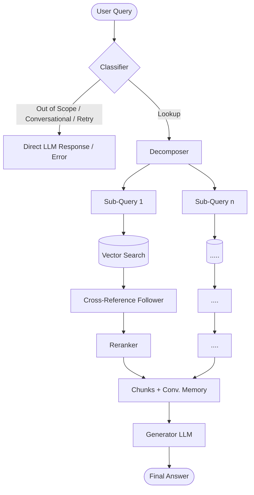

# Agentic RAG for Basketball Rules

A multi-agent Retrieval-Augmented Generation (RAG) system for querying and comparing official basketball rulebooks from different leagues (NBA, WNBA, NCAA, FIBA).


**[Chat Here](https://agentic-rag-for-basketball-rules.streamlit.app/)**

## Architecture


## Stack
* **Vector Database:** ChromaDB (Cloud)
* **LLM Provider:** OpenRouter (GPT-5-mini)
* **Embedding Model:** Cohere (`embed-english-v3.0`)
* **Reranker:** Cohere (`rerank-v4.0-fast`)
* **Frontend:** Streamlit

## Local Setup

1. Clone the repository and install dependencies:
```bash
pip install -r requirements.txt
```

2. Create a `.env` file based on `.env.example`:
```ini
OPENROUTER_API_KEY="your_openrouter_key"
COHERE_API_KEY="your_cohere_key"
CHROMA_HOST="your_chroma_host"
CHROMA_TENANT="your_chroma_tenant"
CHROMA_DATABASE="your_chroma_database"
CHROMA_API_KEY="your_chroma_api_key"
```

### 1. Ingestion (CLI only)
Rulebook ingestion runs via the CLI. Documents must be placed in the `Rulebooks/` directory (e.g., `Rulebooks/NBA.pdf`).

```bash
python main_cli.py ingest --league NBA
```

### 2. Chat Interface (Streamlit)
To run the web interface locally:

```bash
streamlit run app.py
```

### 3. Chat Interface (CLI)
To run the chat directly in the terminal:

```bash
python main_cli.py chat
python main_cli.py chat --trace  # Shows agent reasoning steps
```
